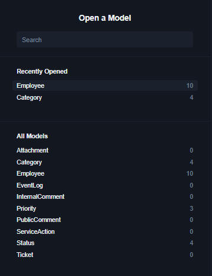

# Database Schema Implementation: IT Ticketing System

## Overview
Implementing the relational database schema and initial data seeding for the IT Ticketing System using Prisma ORM.

## File
```text
server
├── prisma
│   ├── schema.prisma
│   └── seed.ts
```

---

## Technical Specifications & Models

### 1. schema.prisma Definition

#### Ticket

| Column | Type | Keys & Constraints |
| :--- | :--- | :--- |
| `id` | int | `PK`, `Unique` |
| `code` | text | `Unique` (Format: e.g., `TCK-YYYY-XXXXXX`) |
| `created_date` | datetime | |
| `summary` | text | |
| `description` | text | |
| `resolution_summary` | text | |
| `category_id` | int | `FK` to `Category(id)` |
| `requested_priority_id` | int | `FK` to `Priority(id)` |
| `it_priority_id` | int | `FK` to `Priority(id)` |
| `current_status_id` | int | `FK` to `Status(id)` |
| `ticket_owner_id` | int | `FK` to `Employee(id)` |
| `last_updated_date` | datetime | |


#### Category

| Column | Type | Keys & Constraints |
| :--- | :--- | :--- |
| `id` | int | `PK`, `Unique` |
| `name` | text | `Unique` |

#### Priority

| Column | Type | Keys & Constraints |
| :--- | :--- | :--- |
| `id` | int | `PK`, `Unique` |
| `name` | text | `Unique` (Values: High, Medium, Low) |
### Status

| Column | Type | Keys & Constraints |
| :--- | :--- | :--- |
| `id` | int | `PK`, `Unique` |
| `name` | text | `Unique` (Values: Open, In Progress, Pending, Resolved) |

### Employee

| Column | Type | Keys & Constraints |
| :--- | :--- | :--- |
| `id` | int | `PK`, `Unique` |
| `code` | text | `Unique` |
| `name` | text | |
| `created_date` | datetime | |

#### Public Comment

| Column | Type | Keys & Constraints |
| :--- | :--- | :--- |
| `id` | int | `PK`, `Unique` |
| `ticket_id` | int | `FK` to `Ticket(id)` |
| `created_date` | datetime | |
| `owner_id` | int | `FK` to `Employee(id)` |
| `message` | text | |

#### Internal Comment

| Column | Type | Keys & Constraints |
| :--- | :--- | :--- |
| `id` | int | `PK`, `Unique` |
| `ticket_id` | int | `FK` to `Ticket(id)` |
| `created_date` | datetime | |
| `owner_id` | int | `FK` to `Employee(id)` |
| `message` | text | |

#### Attachment

| Column | Type | Keys & Constraints |
| :--- | :--- | :--- |
| `id` | int | `PK`, `Unique` |
| `ticket_id` | int | `FK` to `Ticket(id)` |
| `created_date` | datetime | |
| `owner_id` | int | `FK` to `Employee(id)` |
| `file_name` | text | |
| `file_url` | text | Store file path/S3 link |
| `file_type` | text | Allowed: `.jpg`, `.png`, `.webp`, `.pdf` |
| `file_size_bytes` | int | Max 5MB (5,242,880 bytes) |

#### Service Action

| Column | Type | Keys & Constraints |
| :--- | :--- | :--- |
| `id` | int | `PK`, `Unique` |
| `ticket_id` | int | `FK` to `Ticket(id)` |
| `created_date` | datetime | |
| `owner_id` | int | `FK` to `Employee(id)` |
| `message` | text | |


#### Event Log

| Column | Type | Keys & Constraints |
| :--- | :--- | :--- |
| `id` | int | `PK`, `Unique` |
| `ticket_id` | int | `FK` to `Ticket(id)` |
| `created_date` | datetime | |
| `owner_id` | int | `FK` to `Employee(id)` |
| `message` | text | Details of the state change |

---

### 2. Seeding Configuration (server/prisma/seed.ts)

* **Priority Table Entries**: `High`, `Medium`, `Low`
* **Status Table Entries**: `Open`, `In Progress`, `Pending`, `Resolved`

---
## Tasks & Steps to Complete
1. Design the database structure in design/database.md, defining the required tables and their fields.
2. Refine the database design by adding primary keys (PK), foreign keys (FK), unique constraints, and table relationships.
3. Implement the finalized design in server/prisma/schema.prisma and server/prisma/seed.ts using AI assistance to translate the database design into Prisma schema and seed logic.
4. Generate and apply the database migration using npx prisma migrate dev.
5. Populate the database using npx prisma db seed.
6. Verify the database using npx prisma studio to inspect the tables, relationships, constraints, and seeded data.

---

## Acceptance Criteria
- [ ] All foreign key constraints and dual relations on `Priority` (`requested_priority_id` and `it_priority_id`) resolve without schema errors.
- [ ] Database migration runs cleanly without breaking existing configurations.
- [ ] Seeding populates all lookup tables and all 10 employee records accurately.

--- 

## Result
