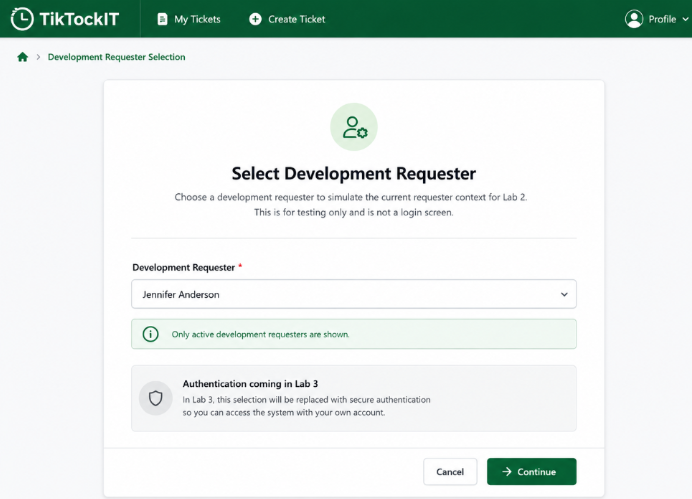
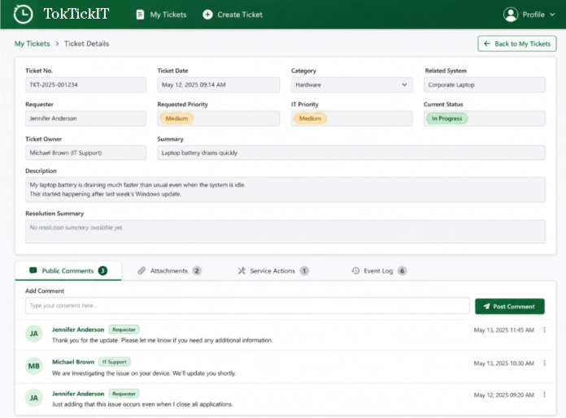

# TokTickIT — UI Specification (Lab 2)

## 1. Design Tokens

### 1.1 Color
| Token | Hex | Usage |
|---|---|---|
| Primary green | #006B3C | Primary buttons, links, active nav, focus ring |
| Secondary green | #0B7A46 | Hover states, secondary accents |
| Pale green | #EAF6EF | Selected rows, info banners, badge backgrounds |
| Page background | #F5F7F6 | App shell background |
| Surface | #FFFFFF | Cards, panels, form containers, restrained shadow/border |
| Text (primary) | #173B2D | Body copy, headings |
| Error | #B42318 | Validation messages, failure states |
| Warning (amber) | #B54708 | Non-decorative use only (e.g. "5 MB limit" hint), never alone to convey status |
| Success | #16803C | Confirmation banners — always paired with a text label, never color alone |

Read-only fields get a visually distinct shading from editable fields (pale grey/green fill,
no focus ring, not tab-stoppable as an input).

### 1.2 Layout / Breakpoints
| Breakpoint | Range | Behavior |
|---|---|---|
| Desktop | ≥ 992px | Multi-column, centered content, max-width container |
| Tablet | 768–991px | Two columns where practical |
| Mobile | < 768px | All fields stack vertically, touch-friendly (≥44px) targets, no horizontal scroll |

No clipped labels, overlapping messages, or hidden buttons at any breakpoint (AC-27).

### 1.3 Shared Component Rules
- One consistent field height across all inputs/selects.
- Multiline Description textarea resizes vertically without breaking layout.
- Every icon-only control has an accessible label (`aria-label`).
- Visible focus indicator (outline in Primary green) on every interactive control for keyboard
  navigation (AC-28).
- Status/Priority badges: color + text together, never color alone.

---

## 2. Application Shell

- TokTickIT logo/identity, top-level nav: **My Tickets**, **Create Ticket**.
- Current Requester's name displayed with a **Change Requester** action (routes back to
  Selection, per BR-07).
- Active nav item visually indicated (underline or filled background in Primary green).
- Mobile: nav collapses into a menu; touch targets remain ≥44px.

---

## 3. Screen: Development Requester Selection

**Purpose:** testing-only identity switcher (BR-05) — must never be presented as login.

| State | Behavior |
|---|---|
| Default | Dropdown of active Requesters only (BR-06); explanatory copy: "Development testing tool — not a login." |
| Loading | Skeleton/spinner while `GET /api/dev-requesters` resolves |
| Empty | No active Requesters — message + guidance, no dropdown interaction possible (AC-25) |
| API failure | Safe error state with retry action |

- Selecting a Requester and confirming routes to My Tickets, replacing the requester context
  for every subsequent call (BR-07).
- All controls keyboard-reachable in logical order with visible focus (AC-28).
- Create Ticket / My Tickets / Ticket Detail redirect here until a Requester is selected
  (BR-08, AC-02).

---

## 4. Screen: Create Ticket

**Layout**
- **System-generated fields** (Ticket Number, Ticket Date, Requester) shown read-only, visually
  distinct field styling — never editable, never sent by the client.
- **Category / Related System / Requested Priority/ IT Priority** grouped together as a related field set.
- **Summary** and **Description** given generous width (full-width on all breakpoints).
- **Attachments** section below the main fields, reusing the shared upload control.
- **Actions:** Submit (primary) and Cancel (secondary) at the bottom of the form.

**States**
| State | Behavior |
|---|---|
| Inline validation | Field-level messages on blur/submit (empty Summary, short Description, etc. — AC-05, AC-06) |
| Boundary validation | 150-char Summary passes, 151 fails, with the limit named in the message (AC-07, AC-08) |
| Busy/submitting | Submit disabled + busy indicator for the duration of the in-flight request (BR-19, AC-12) |
| Success | Displays the backend-generated Ticket Number (AC-01) |
| Server/network failure | Safe error banner; all entered field values remain in the form (BR-20, AC-13) |
| Partial failure | Ticket exists and its number is shown; failed Attachment(s) reported separately with a retry path (BR-21, AC-14) |

**Attachment control (shared with Ticket Detail)**
- Client-side pre-check: rejects disallowed types (`.jpg/.jpeg/.png/.webp/.pdf` only) and files
  over 5 MB before any upload call (AC-09, AC-10).
- Shows remaining slots toward the 5 active-Attachment limit; blocks a 6th with a limit-reached
  message (AC-11).

---

## 5. Screen: My Tickets

**Layout**
- Search box (Ticket Number / Summary, case-insensitive partial).
- Filters: Category, Requested Priority, IT Priority, Current Status — combinable.
- **Clear Filters** action and **Create Ticket** action.
- Columns: Ticket Number, Created Date, Summary(Unsortable), Category, Requested Priority, IT Priority
  Current Status, Ticket Owner, Last Updated — clicking a column header toggles sort direction and reverses
  order (AC-17).
- Pagination controls with current page, page size, total items, total pages.

**States**
| State | Trigger | Behavior |
|---|---|---|
| Loading | list request in flight | Skeleton/spinner rows |
| Empty | Requester has never created a Ticket | Distinct Empty state (not No-Results) with a Create Ticket call-to-action (AC-19) |
| No-Results | Requester has Tickets but filters match none | No-Results state with a **Clear Filters** action (AC-20) |
| Failure | list request fails | Safe error state with retry |
| Populated | normal | Table (desktop/tablet) → card list (mobile) |

- Responsive: table collapses to stacked cards under 768px; no horizontal scroll.
- Paging forward loads the next set and updates page metadata correctly (AC-18).
- Combined Category + Requested Priority filters return only matching Tickets (AC-16).
- Changing Requester via the shell action reloads this screen to the new Requester's Tickets
  only (AC-26); no other Requester's Tickets are ever visible (AC-03, AC-04).

---

## 6. Screen: Requester Ticket Detail

**Layout**
- Top Area (Ticket Details): Displays core information fields. All top fields are Read-Only (Ticket No., Ticket Date, Category, Related System, Requester, Priorities, Current Status, Ticket Owner, Summary, Description, Resolution Summary).
- Bottom Area (Tabbed Content): Features dynamic tabs: Public Comments, Attachments, Service Actions, and Event Log.
- Fully read-only in Lab 2 — no status change, comment, internal note, or Actions Taken entry
  (BR-30).

**Attachments panel**
| Item state | Presentation |
|---|---|
| Active | Shown normally with **Download** and **Remove** actions |
| Removed | Greyed out, metadata-only (original file name, uploaded date, removed date, removal reason), visible "Removed" indicator, download control disabled (BR-27, AC-24) |

- **Add Attachment** reuses Create Ticket's upload control and validation rules; a newly added
  Attachment appears in the list as Active without a page reload (AC-21).
- **Download** returns the original file content for an active Attachment (AC-22).
- **Remove** requires a non-empty reason; the action is blocked until one is entered (BR-26,
  AC-23).

---

## 7. Accessibility Checklist (applies to all screens)

- Logical, keyboard-only tab order through every interactive control.
- Visible focus indicator at every point in that order (AC-28).
- Every icon-only button has an `aria-label`.
- Status/Priority conveyed with text + color together, never color alone.
- Error and success messages announced in a way assistive tech can pick up (e.g. `aria-live`
  region for the submit result banner).